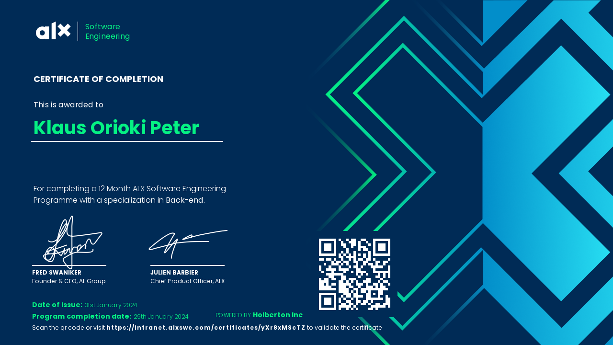

<h3 align="center">"Let's Talk Code"</h3>
<h4 align="center">- Klaus orioki -</h4>

 

 A versatile and passionate full-stack software engineer with With a froclivity for backend development. I specialize in crafting dynamic and responsive web applications, leveraging scripting languages such as Python, JavaScript, and CSS, and frameworks such as Django and Flask to build robust and scalable solutions.
  
 My true passion lies in pushing the boundaries in tech by contributing to larger-scale microservices. Eager to collaborate within teams, I am excited about the prospect of linking with like-minded individuals to drive technological innovation by creating more wholesome, agile systems.

 

 
 

 

## Language and Tools

#### Main Stack:
  
  
  
  
  
  
  
  
  
  

#### Studying in this moment:
  
  
  
  

#### Tools:

  
  
  
  

#### Technologies:

   
 
   
 
   
 

 

## Academic Background:

**Software Engineering Certificate** \
[**ALX, Africa**](https://www.alxafrica.com/)  • complete\
Skills: `Agile Methodologies` `Requirements Engineering` `Software Architecture` `Professional Ethics`
`Project Management` `Software Development` `Software Security` `Software Quality`

**Full Stack Developer** \
[**Moringa School**](https://www.moringaschool.com/) • complete \
Skills: `HTML5` `CSS3` `django` `python` `anguar` `flask` `Bootstrap` `JavaScript` `Git` `GitHub` `TypeScript` `PostgreSQL` `NodeJs` `sqLite`

**Business Information Technology** \
[**Jommo Kenyatta University of Agriculture and Technology **](https://www.jkuat.com/) • complete \
Skills: `HTML` `CSS` `Bootstrap` `JavaScript` `Git` `GitHub` `TypeScript` `PostgreSQL` `Java` `C` `C++`

 

Successful completed The ALX Software Engineering Course

</h4>
 

## Contact me:

   

------
Credit: [Oriokiklaus@gmail.com](https://github.com/niklauspeter)
Last Edited on: 12/03/2024